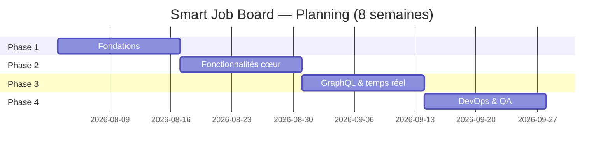

<div align="center">

# 🧩 Smart Job Board

### La plateforme full-stack qui centralise recrutement et recherche d'emploi

[]()
[]()
[]()
[]()
[]()
[]()
[]()

*Un ATS moderne et léger pour startups, PME et équipes tech — pensé pour remplacer la dispersion entre LinkedIn, Indeed et Glassdoor par une seule expérience cohérente.*

[Contexte](#-contexte) • [Fonctionnalités](#-fonctionnalités) • [Architecture](#-architecture) • [Stack technique](#-stack-technique) • [Installation](#-installation--démarrage-rapide) • [API](#-api) • [Roadmap](#-roadmap--planning) • [Équipe](#-équipe)

</div>

---

## 📖 Contexte

Les petites entreprises, startups et équipes de développement s'appuient aujourd'hui sur plusieurs outils disjoints (LinkedIn, Indeed, Glassdoor…) pour gérer leur recrutement. Résultat : friction pour les recruteurs comme pour les candidats, qui doivent naviguer entre plateformes non connectées pour publier, découvrir et postuler à des offres.

**Smart Job Board** centralise ces besoins dans une seule plateforme moderne : publication d'offres, suivi des candidatures, profils d'entreprise et notifications email — le tout pensé pour une expérience fluide côté employeur comme côté candidat.

## 🎯 Objectifs du projet

- Permettre aux **employeurs** de publier et gérer leurs offres d'emploi
- Permettre aux **candidats** de rechercher, filtrer et postuler facilement
- Fournir des **mises à jour en temps quasi-réel** du statut des candidatures via email
- Garantir une **authentification sécurisée** avec contrôle d'accès basé sur les rôles (RBAC)
- Exposer une **API GraphQL** en complément du REST pour un data-fetching efficace
- Mettre en place un **pipeline DevOps de production** dès le premier jour

> Ce projet sert également de **pièce de portfolio** solide pour les deux membres de l'équipe, en appliquant des pratiques full-stack modernes de bout en bout.

## 👥 Public cible

| Segment | Besoin |
|---|---|
| 🚀 Startups & entreprises en croissance | Recruter sans gros budget RH |
| 🏢 PME | Alternative légère aux ATS coûteux |
| 💻 Équipes tech | Filtres par compétences pour rôles techniques |
| 🧑‍💻 Freelances / indépendants | Missions ponctuelles |
| 🎓 Étudiants & juniors | Entrée sur le marché du travail |
| 📋 Recruteurs / hiring managers | Suivi de pipeline de candidats |

---

## ✨ Fonctionnalités

### 👑 Admin — Administration de la plateforme
- Gestion de tous les utilisateurs et comptes
- Approbation ou suspension des comptes entreprise
- Suppression de n'importe quelle offre
- Statistiques globales de la plateforme
- Configuration de la plateforme

### 🏢 Employeur — Côté recrutement
- Création et gestion d'un profil entreprise
- Publication, édition et clôture d'offres d'emploi
- Visualisation et gestion des candidats par offre
- Mise à jour du statut de candidature (`pending → reviewed → accepted / rejected`)
- Alertes email à chaque nouvelle candidature

### 👤 Candidat — Côté recherche d'emploi
- Parcours et recherche d'offres (sans compte requis)
- Inscription et complétion d'un profil personnel
- Candidature avec upload de CV et lettre de motivation
- Suivi des statuts de candidature depuis un tableau de bord personnel
- Sauvegarde d'offres et alertes de recherche personnalisées
- Notifications email lors des changements de statut

### 🌐 Public (non authentifié)
- Parcours et filtrage des offres publiques
- Consultation des pages détail offre / entreprise
- Inscription ou connexion pour postuler

---

## 🏗️ Architecture

```
┌─────────────────────────────────────────────────────────────────────┐
│                              CLIENT (Web)                            │
│   React 18 + TypeScript + Vite + TailwindCSS                        │
│   Apollo Client (GraphQL)  •  TanStack Query (REST)                 │
│   React Hook Form + Zod (validation)                                 │
└───────────────────────────────┬───────────────────────────────────┘
                                 │ HTTPS (REST + GraphQL)
┌───────────────────────────────▼───────────────────────────────────┐
│                    API (NestJS - Modular Clean Architecture)         │
│  ┌───────────┐ ┌───────────┐ ┌────────────┐ ┌──────────────────┐   │
│  │   Auth    │ │  Users    │ │ Companies  │ │       Jobs       │   │
│  │ JWT+Guard │ │  module   │ │   module   │ │  CRUD + filtres  │   │
│  └───────────┘ └───────────┘ └────────────┘ └──────────────────┘   │
│  ┌────────────────────┐ ┌────────────────────────────────────────┐ │
│  │  Applications      │ │  GraphQL Layer (Apollo, code-first)    │ │
│  │  module            │ │  JobResolver + UserResolver + DataLoader│ │
│  └────────────────────┘ └────────────────────────────────────────┘ │
│  Swagger /api/docs  •  Rate limiting  •  Helmet  •  CORS  •  Health │
└───────┬───────────────────────┬───────────────────────┬───────────┘
        │ Prisma ORM            │ BullMQ (queue)         │ Multer
┌───────▼─────────┐   ┌─────────▼──────────┐   ┌─────────▼─────────┐
│   PostgreSQL     │   │ Redis + Nodemailer  │   │  Cloudflare R2     │
│   (base de       │   │ Emails: candidature │   │  Stockage fichiers │
│   données)       │   │ reçue, changement   │   │  (CV, logos...)    │
│                  │   │ de statut, digest   │   │                    │
└──────────────────┘   └─────────────────────┘   └────────────────────┘
```

**Principes d'architecture**
- **Clean Architecture / NestJS modulaire** : séparation stricte modules / services / repositories
- **REST + GraphQL en parallèle** : REST pour les opérations simples (mutations CRUD), GraphQL pour les vues composites avec DataLoader (évite le N+1)
- **Découplage via file d'attente** : les emails ne bloquent jamais la requête HTTP (BullMQ + Redis)
- **Deux dépôts séparés** (`job-board-api` / `job-board-web`) pour un cycle de déploiement indépendant

---

## 🛠️ Stack technique

| Domaine | Technologies |
|---|---|
| **Frontend** | React 18 + TypeScript + Vite |
| **Backend** | NestJS + TypeScript |
| **API** | REST + GraphQL (Apollo, code-first) |
| **Authentification** | JWT + Passport.js (access + refresh tokens) |
| **Temps réel / files d'attente** | BullMQ + Redis (queue email) |
| **Base de données** | PostgreSQL |
| **ORM** | Prisma |
| **Stockage fichiers** | Multer + Cloudflare R2 |
| **Versioning** | Git + GitHub (feature branch workflow) |
| **Conteneurisation** | Docker + Docker Compose |
| **CI/CD** | GitHub Actions |
| **Documentation** | Swagger / OpenAPI + README |
| **Déploiement** | Railway (API) • Vercel (frontend) |

---

## 📁 Structure du projet (prévisionnelle)

```
job-board-api/
├── src/
│   ├── auth/                  # register, login, refresh, JWT guard, RolesGuard
│   ├── users/                 # profil, avatar
│   ├── companies/             # CRUD, logo
│   ├── jobs/                  # CRUD, filtres avancés, pagination, tags
│   ├── applications/          # candidature, retrait, statuts, CV
│   ├── graphql/                # JobResolver, UserResolver, DataLoader
│   ├── email/                  # BullMQ + Nodemailer (templates)
│   ├── cron/                   # clôture auto des offres expirées, digest
│   ├── common/                 # guards, interceptors, filters, decorators
│   └── main.ts
├── prisma/
│   ├── schema.prisma
│   └── migrations/
├── docker-compose.yml
├── .github/workflows/ci.yml
└── README.md

job-board-web/
├── src/
│   ├── pages/                  # listing public, détail offre, dashboards
│   ├── components/
│   ├── features/               # auth, jobs, applications, companies, admin
│   ├── graphql/                # queries/mutations Apollo
│   ├── lib/                    # TanStack Query, Zod schemas
│   └── main.tsx
├── vercel.json
└── README.md
```

---

## 🚀 Installation & démarrage rapide

> ⚠️ Le code n'est pas encore initialisé — cette section décrit le workflow cible une fois le scaffold en place (Phase 1).

### Prérequis
- Node.js ≥ 18
- Docker & Docker Compose
- pnpm (ou npm/yarn)
- Un compte Cloudflare R2 (stockage fichiers)

### 1. Cloner les dépôts
```bash
git clone https://github.com/<org>/job-board-api.git
git clone https://github.com/<org>/job-board-web.git
```

### 2. Backend — `job-board-api`
```bash
cd job-board-api
cp .env.example .env          # configurer DATABASE_URL, JWT_SECRET, REDIS_URL, R2_*
pnpm install
docker compose up -d          # lance postgres + redis
pnpm prisma migrate dev
pnpm run start:dev            # API disponible sur http://localhost:3000
```
📄 Documentation Swagger : `http://localhost:3000/api/docs`

### 3. Frontend — `job-board-web`
```bash
cd job-board-web
cp .env.example .env          # VITE_API_URL, VITE_GRAPHQL_URL
pnpm install
pnpm run dev                  # App disponible sur http://localhost:5173
```

### 4. Variables d'environnement principales

| Variable | Description |
|---|---|
| `DATABASE_URL` | Chaîne de connexion PostgreSQL |
| `REDIS_URL` | Connexion Redis pour BullMQ |
| `JWT_ACCESS_SECRET` / `JWT_REFRESH_SECRET` | Secrets JWT |
| `R2_ACCESS_KEY_ID` / `R2_SECRET_ACCESS_KEY` / `R2_BUCKET` | Stockage Cloudflare R2 |
| `SMTP_HOST` / `SMTP_USER` / `SMTP_PASS` | Envoi d'emails (Nodemailer) |
| `VITE_API_URL` | URL de l'API REST côté frontend |
| `VITE_GRAPHQL_URL` | URL de l'endpoint GraphQL |

---

## 🔌 API

### REST — endpoints principaux (prévisionnels)

| Méthode | Endpoint | Description | Rôle requis |
|---|---|---|---|
| `POST` | `/auth/register` | Inscription | Public |
| `POST` | `/auth/login` | Connexion | Public |
| `POST` | `/auth/refresh` | Rafraîchissement du token | Authentifié |
| `GET` | `/jobs` | Liste des offres (filtres, pagination) | Public |
| `POST` | `/jobs` | Création d'une offre | Employeur |
| `PATCH` | `/jobs/:id` | Édition d'une offre | Employeur |
| `POST` | `/applications` | Postuler à une offre | Candidat |
| `PATCH` | `/applications/:id/status` | Mise à jour du statut | Employeur |
| `GET` | `/companies/:id` | Détail entreprise | Public |
| `GET` | `/admin/stats` | Statistiques plateforme | Admin |

📄 **Source de vérité** : Swagger UI (`/api/docs`) — toute rupture de contrat de réponse doit être discutée avant implémentation (voir [Règles d'équipe](#-règles-de-collaboration-déquipe)).

### GraphQL — exemple de requête

```graphql
query JobsWithCompany {
  jobs(filter: { tags: ["nestjs", "react"] }, pagination: { page: 1, limit: 10 }) {
    items {
      id
      title
      location
      company {
        id
        name
        logoUrl
      }
    }
    totalCount
  }
}
```

Résolu via `JobResolver` avec **DataLoader** pour batcher les appels `company` et éviter le problème N+1.

---

## 🎨 Design & UI

> Design system prévu, à formaliser en Phase 1 (Figma ou équivalent) avant l'implémentation frontend.

**Principes directeurs**
- **Sobre et professionnel** : palette neutre (gris ardoise / bleu profond) + un accent unique pour les CTA
- **TailwindCSS** comme unique système de style, sans surcouche CSS custom
- **Responsive-first** : mobile → tablette → desktop, breakpoints Tailwind standards
- **Accessibilité** : contrastes AA minimum, navigation clavier sur les formulaires et modales

**Pages clés (frontend — Samira)**
- Page publique de listing (recherche, filtres, pagination)
- Page détail offre + flux de candidature (modal upload CV)
- Pages auth : inscription + connexion avec sélection de rôle
- Dashboard candidat : mes candidatures, offres sauvegardées, notifications
- Dashboard employeur : publier une offre, gérer les listings, liste candidats, statuts
- Page profil entreprise
- Panel admin : liste utilisateurs, liste entreprises, vue statistiques

**Composants transverses**
- Formulaires standardisés via **React Hook Form + Zod**
- États de chargement / erreur cohérents (skeletons, toasts)
- Composant de filtre réutilisable (jobs, admin, dashboards)

---

## 🗺️ Roadmap / Planning

| Phase | Durée | Contenu |
|---|---|---|
| **Phase 1 — Fondations** | Semaines 1–2 | Scaffold, config, schéma Prisma, auth, layout de base |
| **Phase 2 — Fonctionnalités cœur** | Semaines 3–4 | Jobs, candidatures, entreprises, dashboard employeur |
| **Phase 3 — GraphQL & temps réel** | Semaines 5–6 | Couche GraphQL, queue email BullMQ, cron jobs, offres sauvegardées |
| **Phase 4 — DevOps & QA** | Semaines 7–8 | DevOps, tests, QA, README, déploiement live |



---

## 📦 Livrables

| Livrable | Responsable |
|---|---|
| API REST + GraphQL (NestJS) | Mohamed |
| Schéma PostgreSQL + migrations Prisma | Mohamed |
| Système de notifications email (BullMQ) | Mohamed |
| Documentation Swagger / OpenAPI | Mohamed |
| Pipeline Docker Compose + GitHub Actions | Mohamed |
| Frontend React (toutes les pages) | Samira |
| UI responsive avec TailwindCSS | Samira |
| Intégration Apollo Client + TanStack Query | Samira |
| Validation de formulaires (React Hook Form + Zod) | Samira |
| Revue du contrat API + tests QA | Les deux |
| README (repo API + repo web) | Les deux |
| Diagramme d'architecture | Mohamed |
| Déploiement live (démo) | Les deux |

---

## 🤝 Règles de collaboration d'équipe

### Workflow Git
- Deux dépôts : `job-board-api` (Mohamed) et `job-board-web` (Samira)
- Stratégie de branches : `main → dev → feature/<nom>`
- Aucun push direct sur `main` ou `dev` — tout passe par Pull Request
- Commits conventionnels : `feat:`, `fix:`, `chore:`, `docs:`

### Contrat API
- Swagger UI (`/api/docs`) fait office de source de vérité pour tous les endpoints
- Toute rupture de contrat de réponse doit être discutée **avant** implémentation
- Le frontend mocke les réponses API en local pendant le développement backend, pour ne jamais être bloqué
- Réunion de revue du contrat API en fin de Semaine 2 et Semaine 4

### Communication
- Standup asynchrone quotidien : *ce que j'ai fait / ce que je fais / mes blocages*
- Point hebdomadaire en visio : revue d'avancement, alignement sur le sprint suivant
- Tâches suivies sur Notion / Linear — aucun travail non documenté

---

## 👥 Équipe

| | Nom | Rôle |
|---|---|---|
| 🛠️ | **Mohamed Ait Tajante** | Backend Developer • DevOps Engineer |
| 🎨 | **Samira Aboutarik** | Frontend Developer • UI/UX Designer |

---

## 📄 Licence

Ce projet est distribué sous licence **MIT**. Voir le fichier `LICENSE` pour plus de détails.

<div align="center">

*Smart Job Board — Technical Specifications • 2026*

</div>
